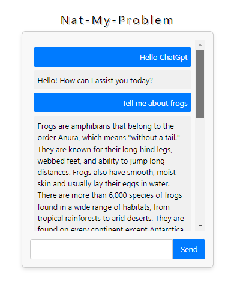

`Nat-MY-Problem`

Chat bot testing the my capabilites with tailwind as well as fetch calls and the Openai api.   
Work in progress.  
You need an api key to run.  
Set it up in a .env folder at the root of your project and make sure to .gitignore it like this:

`.gitgnore`

.env                # Add this line
.env.local
.env.development.local
.env.test.local
.env.production.local

-----------------------------------------

`.env`

REACT_APP_OPENAI_API_KEY="YOUR KEY HERE!  Make sure to inlcude the sk-"

https://www.loom.com/share/0d6331d96e274a0a92a1308dd166b357?sid=70364d33-448b-404c-8579-6fc1ea190ed4

-----------------------------------------

### `npm start`

Runs the app in the development mode.\
Open [http://localhost:3000](http://localhost:3000) to view it in your browser.

